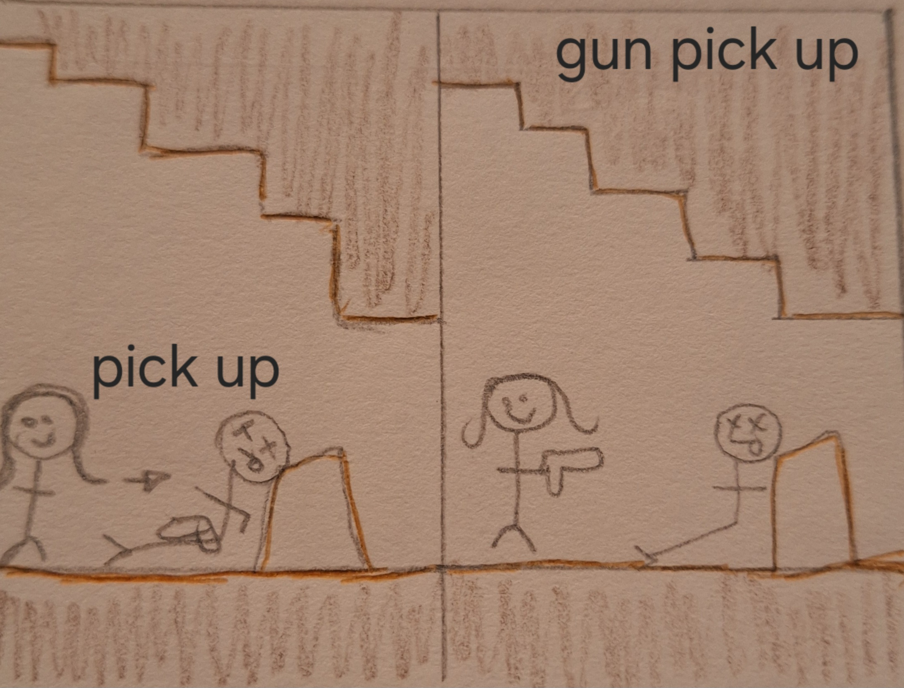

# COMP2150  - Level Design Document
### Name: [Abigail George]
### Student number: [47802162] 

## 1. Player Experience (~700 words)

### 1.1. Discovery
What does the player learn? How does your encounter and broader level design facilitate learning in a way that follows good design practice?

The introduction of different game mechanics sequentially, allows for the player to learn how to use and avoid different aspects of the game. For example the lone spike at the beginning of the game is an introduction to the mechanic and through experimentation the player will learn that touching the spike will make them lose a heart and give them a 3 second immunity to damage caused by spikes and other elements that inflict the same consequence. These mechanics that also inflict damage on the player, as it encourages player experimentation and experience the mechanics is a low stress environment before increasing the difficulty after the player has been introduced and learnt the mechanic. This empowers the player to discover how the make works and how to adapt to the increase of difficulty further into the game where the mechanic is used uniquely.  

In this example the player in slowly introduced into the mechanics. Seen in Section 1 where a single mechanic is present and the player can experiment with it.

### 1.2. Drama
What is the intensity curve? How does your design facilitate increasing yet modulating intensity, with moments of tension and relief? 

The intensity curve slowly rises as the player progresses through the level and as the difficulty rises challenging the abilities of the player. The design of the level enables the game to increase intensity and the emotional experience of the player together as the player progresses. The level design I have created models an example of how after moments of tension there is also relief. This can be seen in my level where after a high intensity situation of jumping over acid and between small spaces between spikes there is then a low intensity situation in the tunnels where the player is in a safe environment figuring out the puzzle involving the movable boxes. This visualises the intensity curve going from up to down depending on the situation the player is in. 

The dramatic arc is a diagram that allows for my level to be visualised in the ideal template on how to successfully design a level that follows good design practice and creates an enjoyable yet challenging experience for the player. 

### 1.3. Challenge
What are the main challenges? How have you designed and balanced these challenges to control the difficulty curve and keep the player in the flow channel?

There are multiple challenges within my level that makes that player engage with the core mechanics of the game. These challenges are designed to test the player in all aspects, from skills to emotional but also allow a sense of accomplishment after the completion of sections that lean towards the harder end of the scale. In turn encouraging more nuanced control by the player to test their abilities and enable them to test if they will be able to complete more challenging obstacles. One main challenge that is embedded within my platformer is the traversing of the levels and avoiding falling off the level as it sets the player back forcing them to complete the seduction again until they gain sufficient skills to not only complete the section of the level they were stuck on but give them the ability to learn valued game skills to accomplish harder challenges in the game. Paired with this first challenge is the added challenge of including other mechanics like moving platforms, chompers and spitters that add another layer of difficulty that pushes a player to learn skills and make decisions based on how they want to play, encouraging new game dynamics. I designed the level so that after moments of difficulty and purposeful testing of player abilities there are pauses of difficulty where the player encounters sections that allow moments of relief such as the moving platforms or in parts of the tunnels where there is no danger.

### 1.4. Exploration
How does your level design facilitate autonomy and invite the player to explore? How do your aesthetic and layout choices create distinct and memorable spaces and/or places?

My level’s design dictates the player's path completely in some sections of the level, especially within the first section of the level as the player is just starting out and is beginning to learn the core mechanics of the game. But there are parts within the level that facilitate self-exploration and the ability to choose their own path in specific areas of the level. Specifically in section 2 there is a sky scale that allows players to choose their own path, the path that is taken determines whether they collect everything that is offered within; the key that is located at the top of the scale and the health case that is easily spotted in the middle. This also determines how many enemy encounters the player faces and forces the player to face the consequences if they decide not to explore all routes available. For instance if the player decides to not explore and go directly to the otherside they won’t collect the second key in turn being unable to open the door at the end of the level.

In this example the player has the choice of which platforms they want to jump on to traverse the level. This is seen in section 2.

## 2. Core Gameplay (~400 words)

### 2.1. Checkpoints

The introduction of the checkpoint first allows players to be able to explore the upcoming mechanics without much consequence and respawn close. This also means that later on in the section the player can respawn in the correct spot. 
### 2.2. Spikes

Introducing  the first mechanic that inflicts damage on the player and because it is close to the checkpoint at the beginning of the level the player can experiment with the spike.  
### 2.3. Acid

Acid is another main damaging mechanic within the game so having it close to the first checkpoint allows for experimentation and how to adapt your basic skills for when the level difficulty gets harder.
### 2.4. Moving Platforms

The moving platform visualises the increase of difficulty of a mechanic and the player can explore how the moving platform works, and the speed and distance it goes.
### 2.5. Health Pickups

The need for health pickups aren’t needed until later in the level as there wasn't much doing damage to the player. The inclusion of the health pick up is where I believe players may begin to need more health.
### 2.6. Keys

This is where the first key is seen, which is at the end of the first section which is just an introduction to the game and its mechanics so it is seen before some of the other core mechanics.
### 2.7. Weapon Pickup (Staff)

This is the first weapon introduced which is seen before the enemies as it gives players the choice of each fighting the enemy or avoiding it.
### 2.8. Passthrough Platforms

This is where the level starts to get more difficult and more player skill is needed. This mechanic starts the parkour element of the level.
### 2.9. Chompers

The Chomper is added where it is solo and allows the player to experiment with the enemy and figure out the abilities of the Chomper; how strong it is and hit range, etc.
### 2.10. Spitters

The Spitter is introduced the same way as the Chomper allowing the player to experiment and determine its strength. This is also the time where the player will determine which enemy is a bigger threat: the Spitter or the Chomper.
### 2.11. Weapon Pickup (Gun)

This mechanic is added last where the difficulty is increasing greatly and the need for more weapons becomes apparent to the player. Allows for different dynamics of play to merge when fighting enemies.
## 3. Spatiotemporal Design
 
### 3.1. Molecule Diagram

### 3.2. Level Map – Section 1

### 3.3.	Level Map – Section 2
.png)
### 3.4.	Level Map – Section 3
.png)
## 4. Iterative Design (~400 words)

The iterative process allowed me to expand my thinking to come up with unique design elements to include into my design. So if one design didnt come with the ideas I wanted I could come up with new ways to fulfil my goal. The process encouraged me to broaden my thinking and to not be disheartened when a design element I wanted to incorporate didn't work but to think of ways to enable it to work or incorporate differently.

These prototypes visualise the difference in how the beginning of the process these designs is how I envisioned my level looking but as the process began and experimentation on how things work the outcome changed. Though these prototypes were still a basic template into how I designed my level and how to add onto it, to accomplish the design goals I had for myself when designing this level. Looking at these prototypes the level I was going to design were simple and did not display the good design practices, as the player wasn't able to learn the different mechanics that are embedded within the game. The designs in some aspects did not allow for much exploration as the player had a set path which in turn limited the player's curiosity, which I did not want and adjusted within my final product.

The prototypes are just one example on how the iterative process improves that quality of my work and how prototyping and experimentation with the game design process allows me to incorporate the best aspects of all my designs into my final level. But because of this type of design format some elements of what is drawn in the prototypes isn't translated into the digital design as they dont communicate the same idea from paper to technology. This means that some of the main ideas in my paper prototypes aren't in my digital version because of the un-usability of the design. Although I used a lot of the same basic layout and mechanic placement as its design, it is easy to translate and visualise conceptually into expressing the same experience type that I want the player to feel.

This is an additional storyboard showcasing different game mechanics in section one. It's a combination of all the mechanics shown in this section as it is the most important part. As it ensures that the player understands how to use the game mechanics and is slowly introduced to how the game works.  

